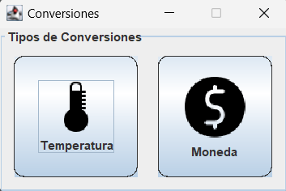
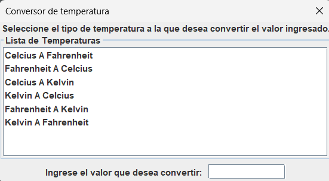
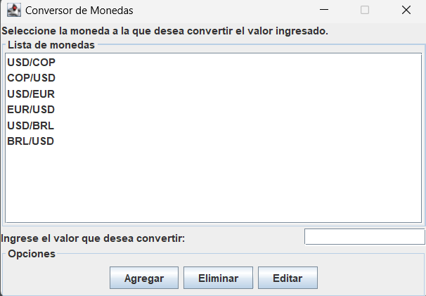
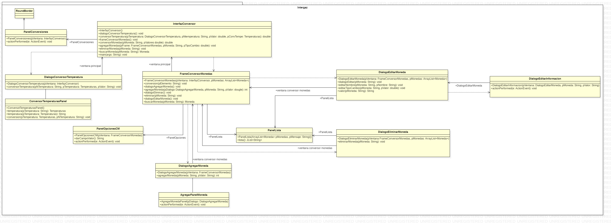

# Conversor Monedas
Este es un proyecto de Alura, en donde se requiere la conversion de ciertas temperaturas, ademas, de poseer un conversor de divisas, en donde no solo se tiene la opcion de convertir estas, sino tambien, de algregar nuevas monedas, eliminar y editarlas.

Aqui tenemos la imagen de la interfaz principal.

La ventana de dialogo que posee el conversor de temperaturas.

La ventana que posee el conversor de divisas.

La interfaz grafica tiene la siguiente estrucura.

